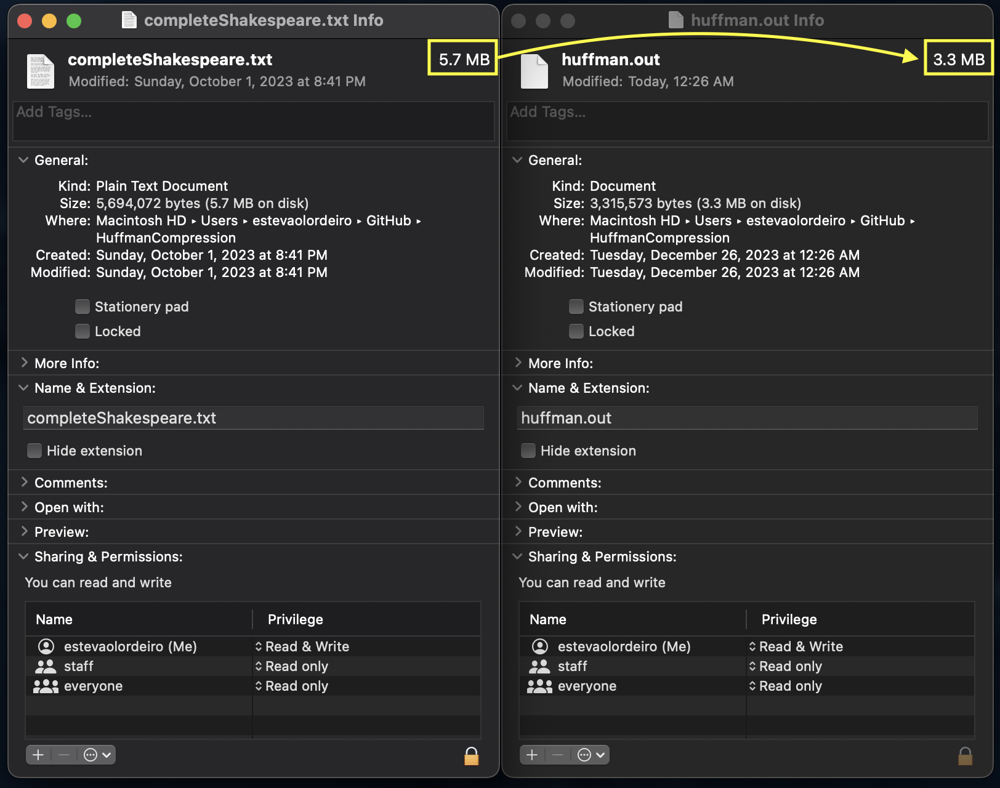

### The picture bellow shows the file size of the original file and the compressed file.

### Note:  
- To enable debug output, define `DEBUG` to 1 on the top of the file  
- The macros in the beginning of the file are for outputting the binary encoding as 0's and 1's  rather than using hex.  
- Macros were pulled from this stackoverflow page:  
    - https://stackoverflow.com/questions/111928/is-there-a-printf-converter-to-print-in-binary-format/25108449#25108449

### Main Program Flow:  
1. Read command line arguments  
    - Simple for loop with switch cases for 'i' and 'o'
    
2. Read input file  
    - Reads the file one char at a time and increments the respective char counter by one.  
    This char counter is a simple array of ints. The index into the array is the char itself
    
3. Build priority queue  
    - Itereate through the frequencies array and encode nonzero entries.  
    - Entries are created using a 'leafNode' that holds information about the character,  
      its frequency and left and right child. Left and right child are both null at the start.  
      The priority queue I am using was created by me for a side project. It was modified to work with leafNodes instead of just ints. It is part of a larger data_structures project  
      that can be found on my personal github page:  
        - https://github.com/elordeiro/DataStructures_C   
    - The queue relies on a dynamic array which is implemented in the vector.c file which is also 
            part of my data_structures project

4. Build Huffman tree  
    - As the huffman algorithm states, we loop through the PQ while it has more than one node and combine  
      the 2 lowest frequency nodes into one node and put this parent node back into the PQ.  
    - The singular node left is the root node of the huffman tree
    
5. Map characters to binary encoding
    - Recursive function to map chars to their huffman coding. 
    - The encoding is held in an array of 'huffman_code' structs. Huffman_code structs hold the binary  encoding and the  
      length of the encoding. 
    - The length of the encoding is the depth of the node on the tree.
        - The enconding follows the traditional way of assigning a 0 when going left and a 1 when going right.
    
6. Write binary encoding to output file
    - While reading the file a second time, char by char, we store in an int buffer the binary encoding for current char
        - When there is more than 8 bits in the buffer
            - Write the first 8 bits to the output file and remove those bits from the buffer

- Extra program features `./huffman -h`:  
    - `-h`: Display this help message
    - `-d`: Decode a file (requires frequency table in header. Encode using '-f')
    - `-f`: Include frequency table in output file
    - `-i`: Specify input file (Default w/out -d flag: "completeShakespeare.txt") (Default w/ -d flag: "huffman.out")
    - `-o`: Specify output file (Default w/out -d flag: "huffman.out") (Default w/ -d flag: "huffman_decoded.txt")
    
- If the `-f` flag is specified, the program will include the frequency table in the header of the output file
    - The format of the header portion of the output file when the `-f` flag is specified is as follows:  
        - 1 byte: All 0's
        - 1 byte: All 1's
        - 1 byte: Number of unique chars in the frequency table
        - 1 byte: Number of bytes required to store the largest frequency
        - char1 frequency1
        - char2 frequency2
        - ...
        - charN frequencyN
        - encoded file
    
- The way the file is decoded is as follows: (using -d flag)
    - Read the first 2 bytes of the file
    - If the first byte is not all 0's or the second byte is not all 1's, then the file does not have a frequency table in the header
        - The program then exits.
    - The next byte in the file is the number of unique chars in the frequency table and the next byte is the number of bytes required to store the largest frequency
    - Set up 2 nested for loops to read the frequency table
        - The outer loop iterates through the number of unique chars
        - The inner loop iterates through the number of bytes required to store the largest frequency
        - The inner loop reads the bytes that make up the frequency and stores it the frequency table
    - The next three steps are identical to the steps in the encode portion of the program
        - Build priority queue
        - Build Huffman tree
        - Map characters to binary encoding
    - The final step is to write the decoded file to the output file
        - Read the file one byte at a time
        - For each bit in the byte, traverse the tree  
            - If the bit is a 0, go left 
            - If the bit is a 1, go right
            - If the node is a leaf node, write the char to the output file and reset the current node to the root node
