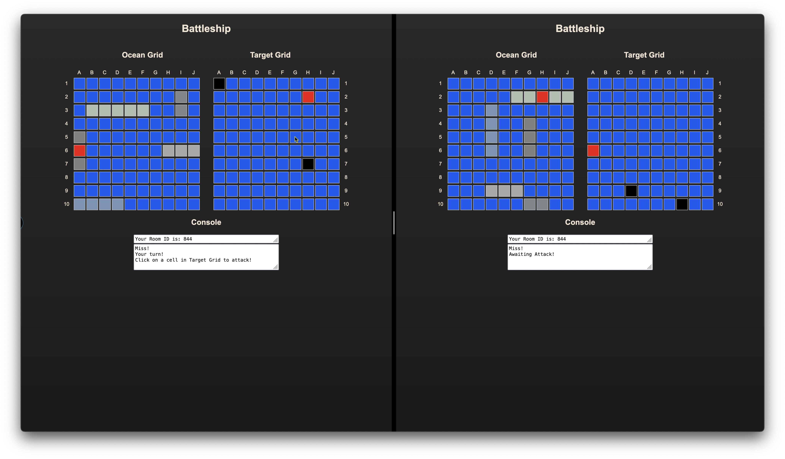
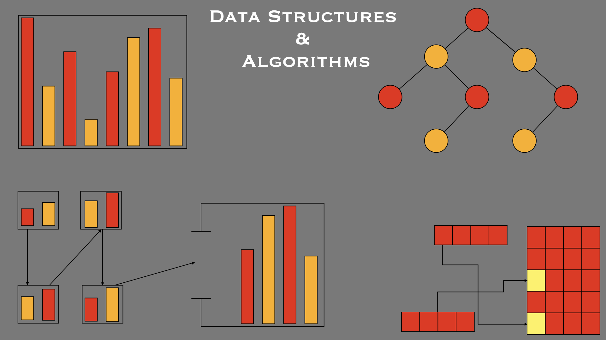
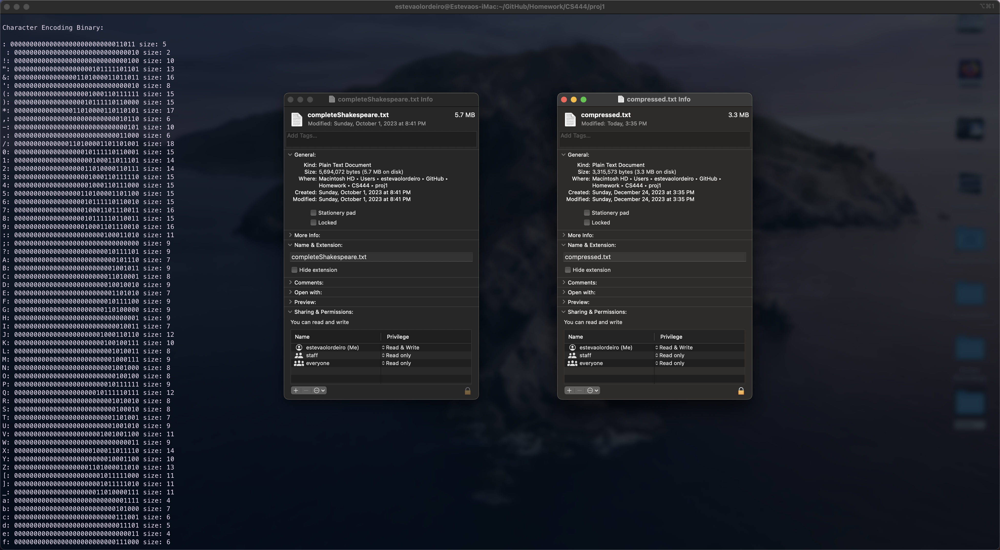
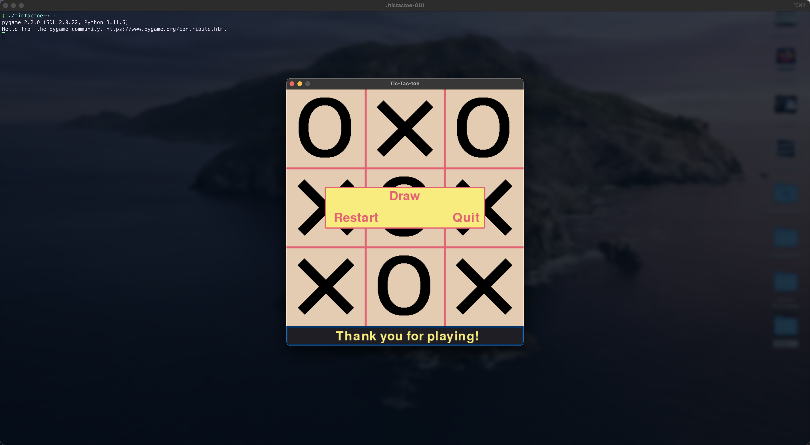
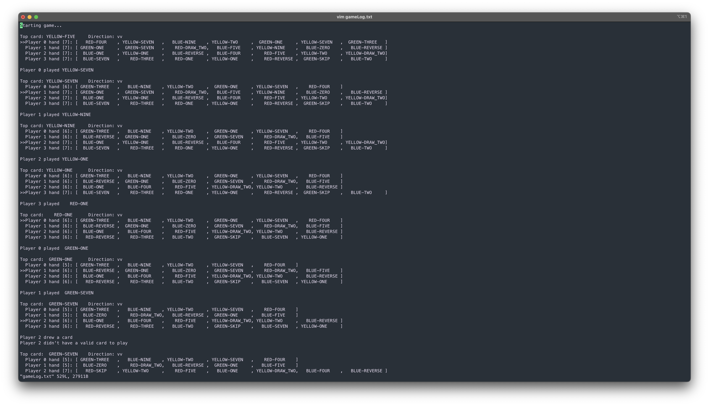
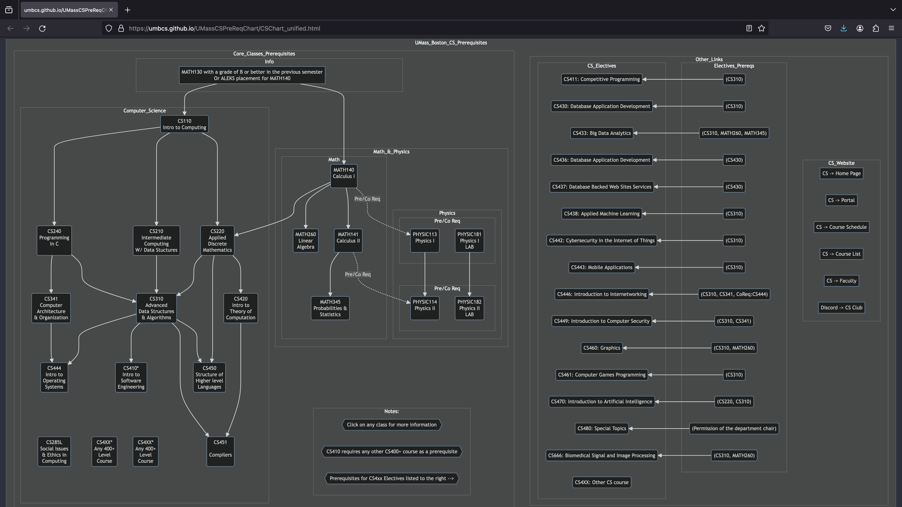

---
# Feel free to add content and custom Front Matter to this file.
# To modify the layout, see https://jekyllrb.com/docs/themes/#overriding-theme-defaults

# layout: page
# title : Welcome!

---
<head>
    <meta charset="UTF-8">
    <meta name="viewport" content="width=device-width, initial-scale=1">
    <meta http-equiv="Cache-Control" content="no-cache, no-store, must-revalidate">
    <meta http-equiv="Pragma" content="no-cache">
    <meta http-equiv="Expires" content="0">
</head>

  &times;
  
  

<h2 style="text-align: center;">These are some of the projects that I have worked on in the past.</h2>  

<table>
    <tr>
        <td>
            
        </td>
        <td>
            <strong><a href="assets/subpages/battleship.html">Battleship</a></strong>
        </td>
        <td>
            <table>
                <tr>
                    <td>
                        <i>Developed a Battleship game in Java as part of a team, using spring framework and MVC architcture.</i>
                    </td>
                </tr>
                <tr>
                    <td>
                        <b>Skilll Showcase:</b> Proficiency in server-side programming and group collaboration.
                    </td>
                </tr>
                <tr>
                    <td>
                        
{{site.github_icon}} Github: <a href="https://github.com/elordeiro/Battleship">Battleship</a>

                    </td>
                </tr>
            </table>
        </td>
    </tr>
    <tr>
        <td>
            
        </td>
        <td>
            <strong><a href="assets/subpages/dsa.html">Data Structures and Algorithms</a></strong>
        </td>
        <td>
            <table>
                <tr>
                    <td>
                        <i>Developed comprehensive data structures and algorithms in C.</i>
                    </td>
                </tr>
                <tr>
                    <td>
                        <b>Skilll Showcase:</b> Proficiency in foundational programming concepts.
                    </td>
                </tr>
                <tr>
                    <td>
                        
{{site.github_icon}} Github: <a href="https://github.com/elordeiro/DataStructures_C">DataStructures_C</a>

                    </td>
                </tr>
            </table>
        </td>
    </tr>
    <!-- <tr><td>  </td><td>  </td><td>  </td></tr> -->
    <tr>
        <td>
            
        </td>
        <td>
            <strong><a href="assets/subpages/huffman.html">Compression and Decompression Program</a></strong>
        </td>
        <td>
            <table>
                <tr>
                    <td>
                        <i>Designed and implemented a program for compression and decompression using custom data structures and Huffman algorithm in C.</i>
                    </td>
                </tr>
                <tr>
                    <td>
                        <b>Skilll Showcase:</b> Practical application of data structures.
                    </td>
                </tr>
                <tr>
                    <td>
                        
{{site.github_icon}} Github: <a href="https://github.com/elordeiro/HuffmanCompression">Compression and Decompression Program</a>

                    </td>
                </tr>
            </table>
        </td>
    </tr>
    <!-- <tr><td>  </td><td>  </td><td>  </td></tr> -->
    <tr>
        <td>
            
        </td>
        <td>
            <strong><a href="assets/subpages/ttt.html">Tic Tac Toe with Minimax Algorithm</a></strong>
        </td>
        <td>
            <table>
                <tr>
                    <td>
                        <i>Implemented Tic Tac Toe with the minimax algorithm in both graphical and command-line interfaces, demonstrating proficiency in UI design and implementation.</i>
                    </td>
                </tr>
                <tr>
                    <td>
                        <b>Skilll Showcase:</b> Proficiency in UI design and implementation.
                    </td>
                </tr>
                <tr>
                    <td>
                        
{{site.github_icon}}Github: <a href="https://github.com/elordeiro/tictactoe">Unbeatable Tic Tac Toe (GUI & CLI) with Minimax Algorithm</a>

                    </td>
                </tr>
            </table>
        </td>
    </tr>
    <!-- <tr><td>  </td><td>  </td><td>  </td></tr> -->
    <tr>
        <td>
            
        </td>
        <td>
            <strong><a href="assets/subpages/uno.html">Uno Game Simulator</a></strong>
        </td>
        <td>
            <table>
                <tr>
                    <td>
                        <i>Developed an Uno game simulator in Java, illustrating object-oriented programming skills, and algorithmic thinking.</i>
                    </td>
                </tr>
                <tr>
                    <td>
                        <b>Skilll Showcase:</b> Proficiency in object-oriented programming.
                    </td>
                </tr>
                <tr>
                    <td>
                        
{{site.github_icon}}Github: <a href="https://github.com/elordeiro/uno">Uno Game Simulator</a>

                    </td>
                </tr>
            </table>
        </td>
    </tr>
    <!-- <tr><td>  </td><td>  </td><td>  </td></tr> -->
    <tr>
        <td>
            
        </td>
        <td>
            <strong><a href="https://umbcs.github.io/UMassCSPreReqChart/CSChart_unified.html">CS Program Classes Prerequisites Website</a></strong>
        </td>
        <td>
            <table>
                <tr>
                    <td>
                        <i>Published a webpage on the CS department's website using mermaid to display all Computer Science classes and their prerequisites, contributing to improved accessibility for all students.</i>
                    </td>
                </tr>
                <tr>
                    <td>
                        <b>Skilll Showcase:</b> Proficiency in web development.
                    </td>
                </tr>
                <tr>
                    <td>
                        
{{site.github_icon}}Github: <a href="https://github.com/elordeiro/UMassCSPreReqChart">CS Program Classes Prerequisites Website</a>

                    </td>
                </tr>
            </table>
        </td>
    </tr>
</table>

